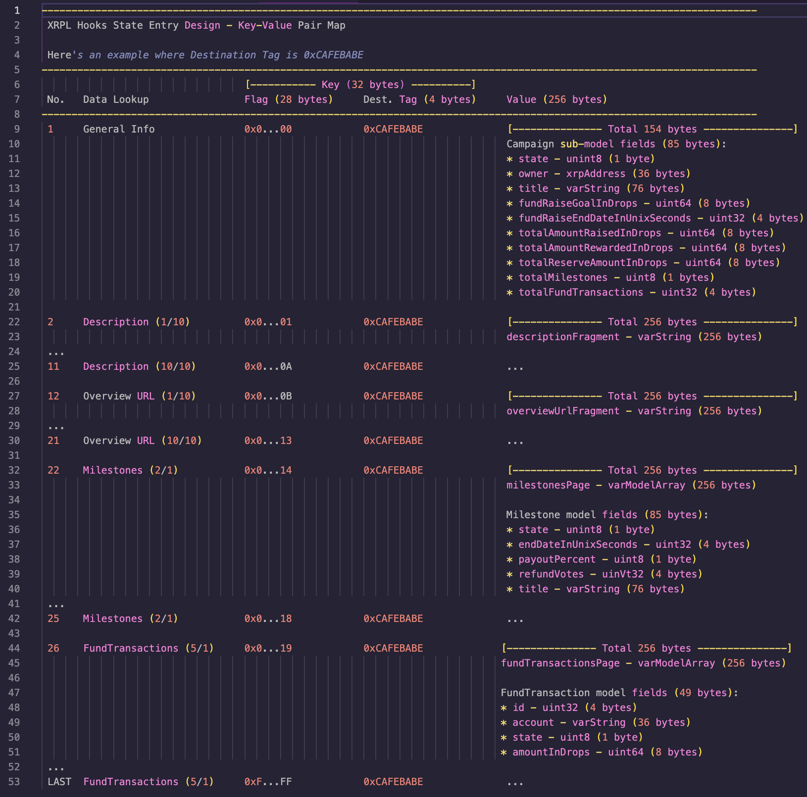

# System Design

## Hooks Terminology

- **Hook**
    - Adds smart contract functionality to the XRP Ledger: *layer one* custom code to influence the behavior and flow of transactions.
    - Hooks are small, efficient pieces of code being defined on an XRPL account, allowing logic to be executed before and/or after XRPL transactions.
- **Hook Account**
    - Refers to the XRPL account that has the Hook installed on.
    - This account executes the Hook smart contract logic when triggered by a transaction.
        - It’s code can’t automatically be invoked on its own, it must be triggered by an incoming transaction.
    - It’s able to store application data to its Hook State.
- **Hook State**
    - Refers to the long-term application state that the Hook Account reads from and writes to.
    - The state is saved to the Hook Account and can be queried using RPC commands (`account_info` & `account_namespace`)
    - The state is represented as a key-value data structure where each entry’s key is 32 bytes and value is 256 bytes.
        - The value bytes is subject to change based on validator voting. At time of writing, the value is set to a max of 256 bytes.
- ************************************Invoke Transaction Type************************************
    - It’s a new transaction type introduced in Hooks.
    - Useful for triggering a Hook account to execute its smart contract logic without having to send XRP.
        - Remember: Hook code can’t automatically be executed, they must be triggered by a transaction. Invoke transaction is meant for doing this.
- **Hook Execution Count**
    - Refers to the number of operations a Hook code can execute worst-case.
    - Each Hook can only execute a maximum of 65,535 operations.

## Hooks Rules/Limitations

- Owner Reserve Fees
    - 1 Owner Reserve Fee for each Hook State entry
- Hook Execution Count (total worst-case)
    - Maximum possible execution instructions are 65,535
    - If it exceeds, then split the logic into multiple Hooks
        - Generally speaking, you do one operation per hook
        - If you really have a very big hook that needs lots of operations make more accounts and use grants to access a shared state
- 1 KB (1000 bytes) Memo payload limit
- Invoke blob payload fee is 1 drop per byte
- Max of 4 Hooks installed on a single account
    - If more than 4 Hooks are required, then
- Hook State entry key is 32 bytes
- Hook State entry value is 256 bytes (subject to changed based on validator voting)
- A Hook can’t automatically send payments/transactions (refund/reward) on its own; this is true for most crypto smart contracts. The Hook must be triggered by another transaction.
    - Invoke is the new transaction type introduced in Hooks where it serves as a trigger transaction that doesn’t require Amount to be sent.
    - FYI: without Invoke, AccountSet would be the trigger transaction to use. It’s currently used for Escrow payments

## Application Terminology

- **Campaign**
    - refers to a fundraising effort on a crowdfunding platform where an individual or organization seeks to raise money from a large number of people for a specific project, idea, or cause.
- ******************Milestone******************
    - refers to a specific, measurable, and time-bound achievement or objective that a campaign creator sets in order to reach their fundraising goal.
- ********************************Milestone Payout********************************
    - TODO
- ************Backer************
    - refers to an individual who supports a campaign by making a financial contribution towards its goal.

## Application Rules/Limitations

1. A crowdfunding project is created by creating a campaign.
    1. A campaign must contain the following mandatory information:
        1. Owner
            1. The owner of the campaign; represented as an XRPL account address.
            2. The Sender account in a transaction to create a new campaign will be assigned as the owner of the campaign.
        2. Title
            1. The campaign title.
            2. 75 character limit
        3. Description
            1. The campaign description.
            2. 2,500 character limit
        4. Overview URL
            1. A URL endpoint where it contains media assets (photos/videos/etc) and additional details about the campaign.
            2. 2,300 character limit
        5. Fund Raise Goal
            1. Represented as XRP drops
        6. Fund Raise End Date
            1. Represented as a unix timestamp
        7. Milestone(s)
            1. Title
                1. The milestone title
                2. 75 character limit
            2. Payout percentage
                1. The payout percentage of a single milestone.
                2. This is a percentage of the remaining funds in a campaign that are paid out to the campaign owner for successfully meeting a milestone.
            3. Milestone End Date
                1. The end date of a milestone for which a milestone payout can occur if at least half of backers approve it.
                2. Represented as a unix timestamp
    2. A campaign’s details cannot be modified/updated after creating it.
        1. Keeping it immutable prevents possible scam exploits.
2. A campaign goes through 2 phases (Fund Raise & Milestone payouts):
    1. Fund Raise phase
        1. Raise funds to meet a campaign’s fund goal. This is done by backers funding a campaign.
        2. The fund raise goal must be met by the fund raise end date.
            1. If it’s not, then the campaign is cancelled.
            2. Otherwise, the campaign can proceed to its next phase of (milestone payouts).
    2. Milestone Payouts phase
        1. Backers whom funded a campaign will have the ability to vote on each milestone:
            1. Vote to approve the milestone payout
                1. By default, a backer who funds a campaign has his/her vote set to approve the current milestone payout.
                2. By the milestone end date, if there’s at least 50% of backers who approve the milestone, then the milestone payout will be sent to the campaign owner.
                    1. The payout is a percentage of the remaining funds.
            2. Vote to reject a milestone to get a refund and cancel the campaign.
                1. If at one time, a majority vote (51% of backers) reject a milestone, then the campaign will issue a refund to all backers and cancel the campaign.
                    1. Refunds will take the remaining the funds in a campaign and distribute it evenly to across all backers.
        2. After the final milestone payout is approved, the campaign owner will have received all funds and the campaign successfully ends.

## Application Operations

1. **Create Campaign**
2. ****************************View Campaigns****************************
3. ************Fund Campaign************
4. **********************Vote Reject**********************
5. **********************Vote Approve**********************
6. ****************************Request Refund Payment****************************
7. ****************************Request Milestone Payout Payment****************************

## Model Design

### Application Models

- These are the application models using JavaScript types.
- **Campaign**
    - `**destinationTag**` - `number`
    - **`state`** - `number`
        - Possible states: TODO
    - `**owner**` - `string`
        - XRP address
    - `**title**` - `string`
        - Max length 75 uft-8 characters
    - `**description**` - `string`
        - Max length 2,500 uft-8 characters
    - `**overviewUrl**` - `string`
        - Max length 2,300 uft-8 characters
    - `**fundRaiseGoalInDrops**` - `BigInt`
        - We use `BigInt` because the maximum bit integer supported in JavaScript is 53 bits and XRP drops is a 64 bit unsigned integer.  Therefore, to work with integers larger than 53 bits, we use the native JS type `BigInt`
    - `**fundRaiseEndDateInUnixSeconds**` - `number`
    - `**totalAmountRaisedInDrops**` - `BigInt`
    - `**totalAmountRewardedInDrops**` - `BigInt`
    - `**totalReserveAmountInDrops**` - `BigInt`
    - `**milestones**` - `Milestone[]`
    - `**fundTransactions**` - `FundTransaction[]`
    - `**backers**` - `Backer[]`
- **Milestone**
    - **`state`** - `number`
        - Possible states: TODO
    - `**endDateInUnixSeconds**` - `number`
    - `**payoutPercent**` - `number`
    - `**rejectVotes**` - `number`
    - `**title**` - `string`
        - Max length 75 uft-8 characters
- **FundTransaction**
    - `**id**` - `number`
    - `**account**` - `string`
        - XRP address
    - `**state**` - `number`
        - Possible states: TODO
    - `**amountInDrops**` - `BigInt`
- **Backer**
    - `**account**` - `string`
        - XRP address
    - `**fundTransactions**` - `FundTransaction[]`

### Data Types (hexadecimal serialization)

- `**uint8**` - **1-byte unsigned integer**
- `**uint16**` - **2-byte unsigned integer (NOT USED - DELETE)**
- `**uint32**` - **4-byte unsigned integer**
- `**uint64**` - **8-byte unsigned integer**
- **`uint224`** - **28-byte unsigned integer**
- `**varString**` - **variable-byte string** (with its length prefixed)
    - `stringLengthPrefix` - **variable-byte unsigned integer**
        - Indicates the string length. This prefix is the first bytes of the `**varString**` and its bytes are of variable size.
        - For a general case, `stringLengthPrefix` bytes is 1 byte which can represent a length of up to 256 characters.
    - `value` - **fixed-byte string** (size fixed to max length in `string-length-prefix`)
        - Contains the actual string content.
        - The size is fixed to the maximum characters that can be represented in `stringLengthPrefix`
            - If the actual string content is less than the maximum characters, then trailing zeros are added to fill up the remaining space.
            - This design allows for easy traversal of strings inside a Hook C script.
- `**xrpAddress**` - **36-byte unsigned integer** (with its length prefixed)
    - `xrpAddressLengthPrefix` - **1-byte unsigned integer**
        - Indicates the XRP Address length (varies between 25-35 characters). This prefix is the first byte of the `**xrpAddress**` and its bytes are of variable size.
    - `value` - ********************35-byte string******************** (size is always fixed to max length of 35 characters)
        - Contains the actual XRP Address content.
        - The size is fixed to the maximum length (35 characters) of an XRP address
            - Similar to **`varString`,** if the actual XRP Address content is less than the maximum characters, then trailing zeros are added to fill up the remaining space.
            - This design allows for easy lookup/traversal of data inside a Hook C script.
- `**model**` - **variable-byte object** (contains various data types)
    - A model can be thought of as a container that can hold different types of data, including other models, in a structured way. This allows for complex data structures to be built up from simpler components, and for data to be organized and accessed in a logical and efficient manner. The specific types and structures included in a model will depend on the specific requirements of the application or system being developed.
- `**varModelArray**` - **variable-byte model array** (with its length prefixed)
    - `model-length-prefix` - **1-byte unsigned integer**
        - The first byte of **`varModelArray`** that indicates the length of the model array. This prefix is the first byte of the **`varModelArray`** and is fixed to 1 byte.
        - It is fixed to 1 byte because there is no use case for having more than 256 elements in a model array.
    - `value` - **variable-byte model array**
        - Contains the actual model array.
        - Unlike `varString`, the size isn’t fixed to the maximum models that can be represented in `model-length-prefix`
            - Its easy lookup/traversal is already derived from the impositions of previous data types.

### Hook State Entry Design

- Each Hook State entry is comprised of a key-value pair
    - Key is 32 bytes
    - Value is 256 bytes (based on validator voting)
- ****************************************Hook State Key****************************************
    - Key - 32 bytes
        - data lookup flag - 28 bytes
        - destination tag - 4 bytes
- ********************************Hook State Value********************************
    - Value - 256 bytes
        - Since value is limited to 256 bytes, it can contain 1 model, fragmented model, or even multiple models (paginated) in a single entry.
            - 1 model:
                - General Info
            - Fragmented models:
                - Description - 1/10 data instance occupies a single entry
                - Overview URL - 1/10 data instance occupies a single entry
            - Paginated models:
                - Milestones - 2/1 data instances occupies a single entry
                - FundTransactions - 5/1 data instances occupies a single entry
        - Refer to Hook State Visualization table for clarification.
- ******************************Hook State Visualization Table******************************

  

### Transaction Mode Flags

- A transaction mode flag represents what application operation to execute in the Hook Account (the Hook C script).
- This flag is always represented as a **1-byte unsigned hexadecimal integer.**
- `**MODE_CREATE_CAMPAIGN_PART_A_FLAG**` - `0x00`
- `**MODE_CREATE_CAMPAIGN_PART_B_FLAG**` - `0x01`
- `**MODE_FUND_CAMPAIGN_FLAG**` - `0x02`
- `**MODE_VOTE_REJECT_FLAG**` - `0x03`
- `**MODE_VOTE_APPROVE_FLAG**` - `0x04`
- `**MODE_REQUEST_REFUND_PAYMENT_FLAG**` - `0x05`
- `**MODE_REQUEST_MILESTONE_PAYOUT_PAYMENT_FLAG**` - `0x06`

### Transaction Payload Models

- **`CreateCampaignPayloadPartA`** - `**model**` (194 bytes)
    - `modeFlag` - `**MODE_CREATE_CAMPAIGN_PART_A_FLAG`** (1 byte)
    - `title` - **`varString`** (76 bytes)
        - stringLengthPrefix (1 byte)
        - value (75 bytes)
    - `fundRaiseGoalInDrops` - `**uint64**` (8 bytes)
    - `fundRaiseEndDateInUnixSeconds` - `**uint32**` (4 bytes)
    - `totalAmountRaisedInDrops` - `**uint64**` (8 bytes)
    - `totalAmountRewardedInDrops` - `**uint64**` (8 bytes)
    - `totalReserveAmountInDrops` - `**uint64**` (8 bytes)
    - `totalMilestones` - `**uint8**` (1 byte)
- **`CreateCampaignPayloadPartB`** - `**model**` (5,666 bytes)
    - `modeFlag` - `**MODE_CREATE_CAMPAIGN_PART_B_FLAG`** (1 byte)
    - `description` - **`varString`** (2502 bytes)
        - stringLengthPrefix (2 bytes)
        - value (2500 bytes)
    - `overviewURL` - **`varString`** (2302 bytes)
        - stringLengthPrefix (2 bytes)
        - value (2300 bytes)
    - `milestones` - **`varModelArray`** (max 861 bytes)
        - `model-length-prefix` - `**uint8**` (1 byte)
        - `value` - `**model(s)**` (max 860 bytes)
            - `milestoneModel` - (86 bytes)
                - `state` - **`uint8`** (1 byte)
                - `endDateInUnixSeconds` - `**uint32**` (4 bytes)
                - `payoutPercent` - **`uint8`** (1 byte)
                - `rejectVotes` - `**uint32**` (4 bytes)
                - `title` - **`varString`** (76 bytes)
                    - stringLengthPrefix (1 byte)
                    - value (75 bytes)
- `**FundCampaignPayload**` - `**model`** (1 byte)
    - `modeFlag` - `**MODE_FUND_CAMPAIGN_FLAG`** (1 byte)
- `**VoteRejectPayload**` - `**model`** (1 byte)
    - `modeFlag` - `**MODE_VOTE_REJECT_FLAG`** (1 byte)
    - `fundTransactionId` - `**uint32**` (4 bytes)
- `**VoteApprovePayload**` - `**model`** (1 byte)
    - `modeFlag` - `**MODE_VOTE_APPROVE_FLAG`** (1 byte)
    - `fundTransactionId` - `**uint32**` (4 bytes)
- **`RequestRefundPaymentPayload`** - `**model`** (1 byte)
    - `modeFlag` - `**MODE_REQUEST_REFUND_PAYMENT_FLAG`** (1 byte)
    - `fundTransactionId` - `**uint32**` (4 bytes)
- **`RequestMilestonePayoutPaymentPayload`** - `**model`** (1 byte)
    - `modeFlag` - `**MODE_REQUEST_MILESTONE_PAYOUT_PAYMENT_FLAG`** (1 byte)

### Application State Flags

- An application state flag represents the current state of an entity: Campaign, Milestone, FundTransaction.
- This flag is always represented as a **1-byte unsigned hexadecimal integer.**
- Campaign states:
    - `state` - **********`uint8`********** (1 byte) - possible values:
        - `**CAMPAIGN_STATE_FUND_RAISE_FLAG**` - `0x00`
        - `**CAMPAIGN_STATE_MILESTONE_1_FLAG**` - `0x01`
        - `**CAMPAIGN_STATE_MILESTONE_2_FLAG**` - `0x02`
        - `**CAMPAIGN_STATE_MILESTONE_3_FLAG**` - `0x03`
        - `**CAMPAIGN_STATE_MILESTONE_4_FLAG**` - `0x04`
        - `**CAMPAIGN_STATE_MILESTONE_5_FLAG**` - `0x05`
        - `**CAMPAIGN_STATE_MILESTONE_6_FLAG**` - `0x06`
        - `**CAMPAIGN_STATE_MILESTONE_7_FLAG**` - `0x07`
        - `**CAMPAIGN_STATE_MILESTONE_8_FLAG**` - `0x08`
        - `**CAMPAIGN_STATE_MILESTONE_9_FLAG**` - `0x09`
        - `**CAMPAIGN_STATE_MILESTONE_10_FLAG**` - `0x0A`
        - `**CAMPAIGN_STATE_FAILED_FUND_RAISE_FLAG**` - `0x0B`
        - `**CAMPAIGN_STATE_FAILED_MILESTONE_FLAG**` - `0x0C`
        - `**CAMPAIGN_STATE_COMPLETED_FLAG**` - `0x0D`
- Milestone states:
    - `state` - **********`uint8`********** (1 byte) - possible values:
        - `**MILESTONE_STATE_UNSTARTED_FLAG**` - `0x00`
        - `**MILESTONE_STATE_IN_PROGRESS_FLAG**` - `0x01`
        - `**MILESTONE_STATE_FAILED_FLAG**` - `0x02`
        - `**MILESTONE_STATE_COMPLETED_FLAG**` - `0x03`
        - `**MILESTONE_STATE_PAID_FLAG**` - `0x04`
- FundTransaction states:
    - `state` - **********`uint8`********** (1 byte) - possible values:
        - `**FUND_TRANSACTION_STATE_REJECT_FLAG**` - `0x00`
        - `**FUND_TRANSACTION_STATE_APPROVE_FLAG**` - `0x01`
        - `**FUND_TRANSACTION_STATE_REFUNDED_FLAG**` - `0x02`

### Hook State Key Data Lookup Flags

- A hook state key data lookup flag represents which campaign data to lookup from the Hook Account’s hook state.
- This flag is always represented as a **28-byte unsigned hexadecimal integer.**
- `**DATA_LOOKUP_GENERAL_INFO_FLAG**` - `0x00`
- `**DATA_LOOKUP_DESCRIPTION_FRAGMENT_START_INDEX_FLAG**` - `0x01`
- `**DATA_LOOKUP_DESCRIPTION_FRAGMENT_END_INDEX_FLAG**` - `0x0A`
- `**DATA_LOOKUP_OVERVIEW_URL_FRAGMENT_START_INDEX_FLAG**` - `0x0B`
- `**DATA_LOOKUP_OVERVIEW_URL_FRAGMENT_END_INDEX_FLAG**` - `0x13`
- `**DATA_LOOKUP_MILESTONES_PAGE_START_INDEX_FLAG**` - `0x14`
- `**DATA_LOOKUP_MILESTONES_PAGE_END_INDEX_FLAG**` - `0x18`
- `**DATA_LOOKUP_FUND_TRANSACTIONS_PAGE_START_INDEX_FLAG**` - `0x19`
- `**DATA_LOOKUP_FUND_TRANSACTIONS_PAGE_END_INDEX_FLAG**` - `0xFFFFFFFFFFFFFFFFFFFFFFFFFFFFFFFFFFFFFFFFFFFFFFFFFFFFFFFF`

### Hook State Models

- **`HookState`** - `**model**`
    - `entries` - `**HookStateEntry[]**`
- **`HookStateEntry`** - `**model**`
    - `key` - `**HookStateKey**`
    - `value` - **`HookStateValue`**
- `**HookStateKey**` - `**model**`
    - `encoded` - ****************************32-byte string****************************
    - `decoded` - ****************************32-byte object****************************
        - `dataLookupFlag` - **`uint224`** (28-byte unsigned integer)
        - `destinationTag` - **`uint32`** (4-byte unsigned integer)
- `**HookStateValue**` - `**model**`
    - `dataLookupFlag` - **`uint224`** (28-byte unsigned integer)
    - `encoded` - ****************************256-byte string****************************
    - `decoded` - **`HSVCampaignGeneralInfoDecoded` or `HSVCampaignDescriptionFragmentDecoded` or `HSVCampaignOverviewURLFragmentDecoded` or `HSVCampaignMilestonesPageDecoded` or `HSVCampaignFundTransactionsPageDecoded`**
- **`HSVCampaignGeneralInfoDecoded`**
    - `state` - **`uint8`** (1 bytes)
    - `owner` - **`xrpAddress`** (36 bytes)
        - stringLengthPrefix (1 byte)
        - value (35 bytes)
    - `title` - **`varString`** (76 bytes)
        - stringLengthPrefix (1 byte)
        - value (75 bytes)
    - `fundRaiseGoalInDrops` - `**uint64**` (8 bytes)
    - `fundRaiseEndDateInUnixSeconds` - `**uint32**` (4 bytes)
    - `totalAmountRaisedInDrops` - `**uint64**` (8 bytes)
    - `totalAmountRewardedInDrops` - `**uint64**` (8 bytes)
    - `totalReserveAmountInDrops` - `**uint64**` (8 bytes)
    - `totalMilestones` - `**uint8**` (1 bytes)
    - `totalFundTransactions` - `**uint32**` (4 bytes)
- **`HSVCampaignDescriptionDecoded`**
    - `fragments` - **`HSVCampaignDescriptionFragmentDecoded[]`** (Max 2,560 bytes)
    - `compositeValue` - **`string`** (Max 2,560 bytes)
- **`HSVCampaignDescriptionFragmentDecoded`**
    - `value` - **`varString`** (Max 255 bytes, discard prefix byte)
- `**HSVCampaignOverviewURLDecoded**`
    - `fragments` - **`HSVCampaignOverviewURLFragmentDecoded[]`** (Max 2,560 bytes)
    - `compositeValue` - **`string`** (Max 2,560 bytes)
- **`HSVCampaignOverviewURLFragmentDecoded`**
    - `value` - **`varString`** (Max 255 bytes)
- `**HSVCampaignMilestonesDecoded**`
    - `pages` - **`HSVCampaignMilestonesPageDecoded[]`** (Max 1,280 bytes)
    - `compositeValue` - **`Milestone[]`** (Max 1,280 bytes)
- `**HSVCampaignMilestonesPageDecoded**`
    - `value` - **`Milestone[] - max length 2`** (Max 255 bytes, discard prefix byte)
- `**HSVCampaignFundTransactionsDecoded**`
    - `pages` - **`HSVCampaignFundTransactionsPageDecoded[]`** (Max bytes is virtually unlimited)
    - `compositeValue` - **`FundTransaction[]`** (Max bytes is virtually unlimited)
- `**HSVCampaignFundTransactionsPageDecoded**`
    - `value` - **`FundTransaction[] - max length 5`** (Max 255 bytes, discard prefix byte)

### Hook State to Application State Model Converter

- `**ApplicationState**`
    - `campaigns` - `**Campaign[]**`
- `**HookStateToAppStateUtility**`
    - `processHookState(): **ApplicationState**`

### System Application Operation Flow

- There are 2 entities that will be communicating with each other:
    1. Client
    2. Hook
- **1. Create Campaign**
    1. Client submits a `Payment` transaction to Hook Account with these fields:
        1. Campaign destination tag (randomly generated on client-side).
        2. Hex encoded in `Memos` payload:
            1. **`CreateCampaignPayloadPartA`**
    2. The Hook is invoked on the incoming transaction.
        1. Hook parses the `Payment` transaction
            1. Destination Tag
            2. Transaction Mode from `Memos` payload
            3. `Amount` (create campaign deposit fee)
    3. Transaction mode must be `**MODE_CREATE_CAMPAIGN_PART_A_FLAG**` in order for Create Campaign Part A logic to be invoked.
        1. Rollback transaction on unrecognized mode
    4. Hook will check if `Amount` has enough to cover the new campaign deposit requirement
        1. Campaign deposit is `1,300 XRP`
            1. `1,300 XRP = (26 Hook State entries required for creating a new campaign) * (50 Owner Reserve Fee XRP)`
            2. This will be set to `totalReserveAmountInDrops` in Campaign General Info
        2. If it doesn’t, rollback the transaction.
    5. Hook updates its Hook State
        1. Add new Campaign General Info entry
            1. IMPORTANT: include `totalReserveAmountInDrops` (calculated from previous step)
    6. Hook accepts `Payment` transaction
    7. Client submits an `Invoke` transaction to Hook Account with these fields:
        1. Campaign destination tag
        2. Hex encoded in `Blob` payload:
            1. **`CreateCampaignPayloadPartB`**
                1. Description
                2. OverviewURL
                3. Milestones
    8. Hook is invoked on the incoming transaction
        1. Hook parses the `Invoke` transaction
            1. Destination Tag
                1. Transaction mode from `Memos` payload
    9. Transaction mode must be `**MODE_CREATE_CAMPAIGN_PART_B_FLAG**` in order for Create Campaign Part B logic to be triggered.
        1. Rollback transaction if it’s an unrecognized mode
    10. Hook updates its Hook State by adding remaining campaign data:
        1. Description
        2. OverviewURL
        3. Milestones
    11. Hook accepts `Invoke` transaction
- **2. View Campaigns**
    1. Client sends RPC requests to query Hook State on Hook Account
        1. `account_info`
            1. Get hook namespace_id and use it as a param in the next RPC command
        2. `account_namespace`
            1. Get `namespace_entries` which will contain the HookState entries
    2. Process the Hook State data to get Application State:
        1. Call **`HookStateToAppStateUtility.processHookState(**namespace_entries**)**` to get `**ApplicationState`** instance
    3. View campaigns by looking at `**ApplicationState.campaigns**`
- **3. Fund Campaign**
    1. Client submits a `Payment` transaction to Hook Account with these fields:
        1. Campaign destination tag
        2. Hex encoded in `Memos` payload:
            1. `**FundCampaignPayload**`
    2. The Hook is invoked on the incoming transaction.
        1. Hook Account parses the `Payment` transaction
            1. destination tag
            2. transaction mode from memo payload
            3. Amount
    3. Transaction mode must be `**MODE_FUND_CAMPAIGN_FLAG**` in order for Fund Campaign logic to be invoked.
        1. Rollback transaction on unrecognized mode
    4. Hook will check if `Amount` has enough to cover the reserve fee for adding new data to Hook State
        1. Fund Campaign fee is `10 XRP`
            1. `10 XRP = (1/5 Hook State entry required for adding a FundTransaction entity) * (50 Owner Reserve Fee XRP)`
            2. `**fundCampaignFeeInDrops** = 10,000,000 drops`
        2. If it doesn’t, rollback the transaction.
    5. Hook will check if campaign state is in `**CAMPAIGN_STATE_FUND_RAISE_FLAG**`
        1. It will read this campaign state from Hook State to determine this.
        2. If it’s not, rollback the transaction
    6. Hook updates its Hook State
        1. Update Campaign General Info
            1. increment `totalFundTransactions`
            2. Update ``totalReserveAmountInDrops += **fundCampaignFeeInDrops**`
            3. Update `totalAmountRaisedInDrops += PaymentTransaction.Amount - **fundCampaignFeeInDrops**`
        2. Add new FundTransaction entry
    7. Hook accepts `Payment` transaction
    8. Client queries Hook State to fetch and derive FundTransaction id
        1. FundTransaction id is used later for other backer related transactions such as voting and requesting refund payment.
- **4. Vote Reject**
    1. Client submits an `Invoke` transaction to Hook Account with these fields:
        1. Campaign destination tag
        2. Hex encoded in `Blob` payload:
            1. `**VoteRejectPayload**`
    2. The Hook is invoked on the incoming transaction.
        1. Hook Account parses the `Invoke` transaction
            1. Destination Tag
            2. From `Blob` payload:
                1. Transaction mode 
                2. `fundTransactionId`
    3. Transaction mode must be `**MODE_VOTE_REJECT_FLAG**` in order for Vote Reject logic to be invoked.
        1. Rollback transaction on unrecognized mode
    4. Hook will check if campaign state is in a milestone state (for ex. **`CAMPAIGN_STATE_MILESTONE_1_FLAG`**)
        1. It will read this campaign state from Hook State to determine this.
        2. If it’s not, rollback the transaction
    5. Hook will check if current milestone has reached its end date
        1. If it has, update the Campaign General Info data in Hook State
            1. Update `state` to next campaign state
            2. IMPORTANT: use this as the new current state
    6. Hook will check if `fundTransactionId` exists in Hook State and if Sender Account is associated with it
        1. It will read FundTransaction data from Hook State by using `fundTransactionId` as an index to the FundTransaction index range
        2. If `fundTransactionId` index doesn’t have data or the Sender Account isn’t associated with it:
            1. Rollback the transaction
    7. Hook updates its Hook State
        1. Skip to step 8 if `state` is already in `**FUND_TRANSACTION_STATE_REJECT_FLAG**`
        2. Update FundTransaction data
            1. Change `state` to `**FUND_TRANSACTION_STATE_REJECT_FLAG**`
        3. Update Milestone data
            1. increment `refundVotes`
    8. Hook accepts `Invoke` transaction
- **5. Vote Approve**
    1. Client submits an `Invoke` transaction to Hook Account with these fields:
        1. Campaign destination tag
        2. Hex encoded in `Blob` payload:
            1. `**VoteApprovePayload**`
    2. The Hook is invoked on the incoming transaction.
        1. Hook Account parses the `Invoke` transaction
            1. Destination Tag
            2. From `Blob` payload:
                1. Transaction mode 
                2. `fundTransactionId`
    3. Transaction mode must be `**MODE_VOTE_APPROVE_FLAG**` in order for Vote Approve logic to be triggered.
        1. Rollback transaction on unrecognized mode
    4. Hook will check if campaign state is in a milestone state (for ex. **`CAMPAIGN_STATE_MILESTONE_1_FLAG`**)
        1. It will read this campaign state from Hook State to determine this.
        2. If it’s not, rollback the transaction
    5. Hook will check if current milestone has reached its end date by looking at Milestone `endDateInUnixSeconds`
        1. If it has, update the Campaign General Info data in Hook State
            1. Update `state` to next campaign state
            2. IMPORTANT: use this as the new current state
    6. Hook will check if `fundTransactionId` exists in Hook State and if Sender Account is associated with it
        1. It will read FundTransaction data from Hook State by using `fundTransactionId` as an index to the FundTransaction index range
        2. If `fundTransactionId` index doesn’t have data or the Sender Account isn’t associated with it:
            1. Rollback the transaction
    7. Hook updates its Hook State
        1. Skip to step 8 if `state` is already in `**FUND_TRANSACTION_STATE_APPROVE_FLAG**`
        2. Update FundTransaction data
            1. Change `state` to `**FUND_TRANSACTION_STATE_APPROVE_FLAG**`
        3. Update Milestone data
            1. decrement `refundVotes`
        4. If majority vote (51%) of fund transactions reject a milestone, end the milestone and campaign with failed state flags
            1. `refundVotes / totalFundTransactions >= 0.51`
            2. Update Milestone data
                1. update `state` to `**MILESTONE_STATE_FAILED_FLAG**`
            3. Update Campaign data
                1. update `state` to `**CAMPAIGN_STATE_FAILED_MILESTONE_FLAG**`
    8. Hook accepts `Invoke` transaction
- **6. Request Refund Payment**
    1. Client submits an `Invoke` transaction to Hook Account with these fields:
        1. Campaign destination tag
        2. Hex encoded in `Blob` payload:
            1. **`RequestRefundPaymentPayload`**
    2. The Hook is invoked on the incoming transaction.
        1. Hook Account parses the `Invoke` transaction
            1. Destination Tag
            2. From `Blob` payload:
                1. Transaction mode 
                2. `fundTransactionId`
    3. Transaction mode must be `**MODE_REQUEST_REFUND_PAYMENT_FLAG**` in order for Request Refund Payment logic to be invoked.
        1. Rollback transaction on unrecognized mode
    4. Hook will read from the Hook State if the application state is in these conditions:
        1. Conditions
            1. One of these is enabled for Campaign General Info `state`:
                1. `**CAMPAIGN_STATE_FAILED_FUND_RAISE_FLAG**`
                2. `**CAMPAIGN_STATE_FAILED_MILESTONE_FLAG**`
            2. FundTransaction `state`
                1. Not set to `**FUND_TRANSACTION_STATE_REFUNDED_FLAG**`
        2. If conditions don’t meet, rollback the transaction
    5. Calculate the refund payment
        1. Refund based on original fund percentage of remaining campaign funds (accounting for reserve funds too)
        2. Equations:
            1. `**remainingFundsInDrops** = totalAmountRaisedInDrops  - totalAmountRewardedInDrops`
            2. `**originalFundPercentage** = FundTransaction.amountInDrops / totalAmountRaisedInDrops`
            3. `**refundAmountInDrops** = **remainingFundsInDrops** * **originalFundPercentage**`
    6. Hook emits `Payment` transaction to backer for its refund
        1. Amount is set to `**refundAmountInDrops**` (calculated from previous step)
    7. Hook updates FundTransaction `state`
        1. Set to `**FUND_TRANSACTION_STATE_REFUNDED_FLAG**`
    8. Hook accepts `Invoke` transaction
- **7. Request Milestone Payout Payment**
    1. Client submits an `Invoke` transaction to Hook Account with these fields:
        1. Campaign destination tag
        2. Hex encoded in `Blob` payload:
            1. **`RequestMilestonePayoutPaymentPayload`**
    2. The Hook is invoked on the incoming transaction.
        1. Hook Account parses the `Invoke` transaction
            1. Destination Tag
            2. From `Blob` payload:
                1. Transaction mode
    3. Transaction mode must be `**MODE_REQUEST_MILESTONE_PAYOUT_PAYMENT_FLAG**` in order for Request Milestone Payment logic to be invoked.
        1. Rollback transaction on unrecognized mode
    4. Hook will read from the Hook State if the application state is in these conditions:
        1. Conditions:
            1. Any of the milestone flags are enabled for Campaign General Info `state` , for example:
                1. `**CAMPAIGN_STATE_MILESTONE_1_FLAG**`
            2. Milestone `state`
                1. Not set to `**MILESTONE_STATE_PAID_FLAG**`
        2. If conditions don’t meet, rollback the transaction
    5. Calculate the milestone reward payment
        1. Reward payment based on Milestone `payoutPercent`
        2. Equation:
            1. `**milestoneRewardAmountInDrops** = totalAmountRaisedInDrops * payoutPercent * 0.10`
    6. Hook emits `Payment` transaction to Campaign owner for its milestone reward
        1. Amount is set to `**milestoneRewardAmountInDrops**` (calculated from previous step)
    7. Hook updates its Hook State
        1. Campaign General Info
            1. Update `totalAmountRewardedInDrops -= **milestoneRewardAmountInDrops**`
        2. Milestone `state`
            1. Set to `**MILESTONE_STATE_PAID_FLAG**`
    8. If this is the last milestone of campaign, update Campaign General Info `state`
        1. Set to `**CAMPAIGN_STATE_COMPLETED_FLAG**`
    9. Hook accepts `Invoke` transaction